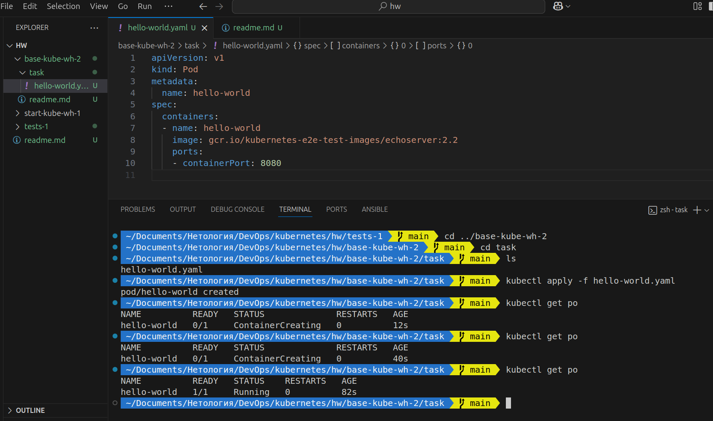
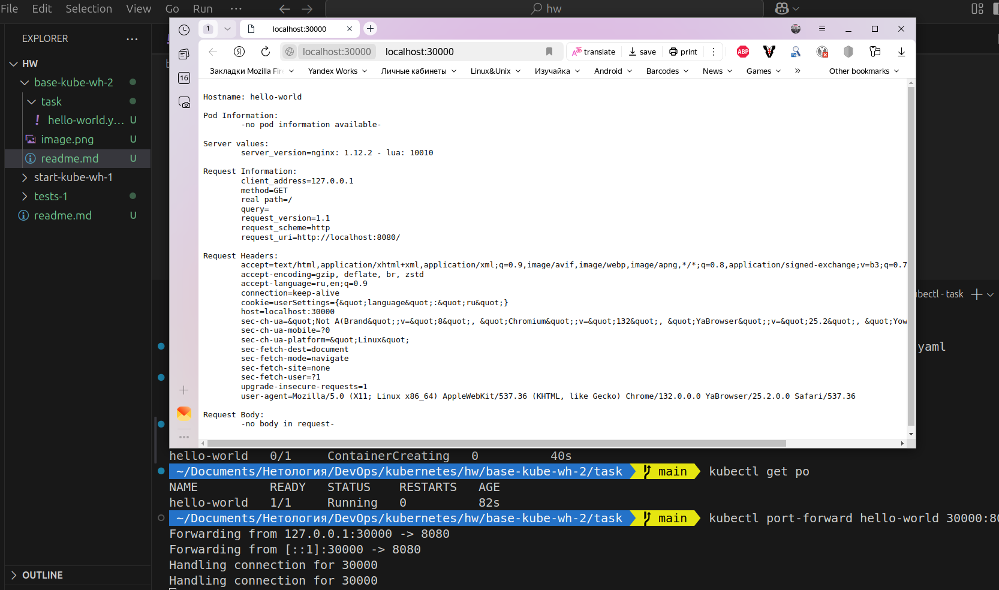
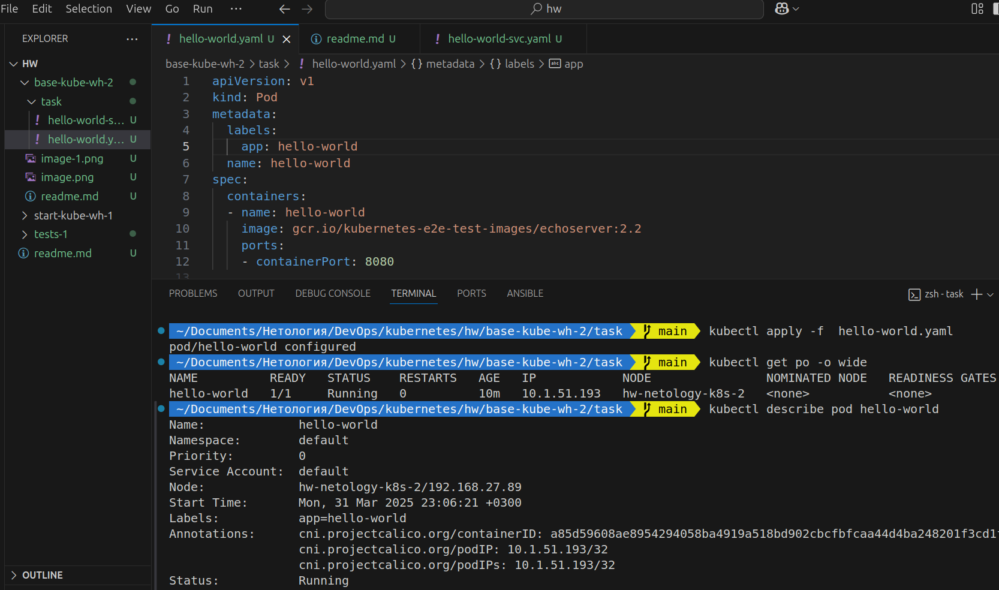
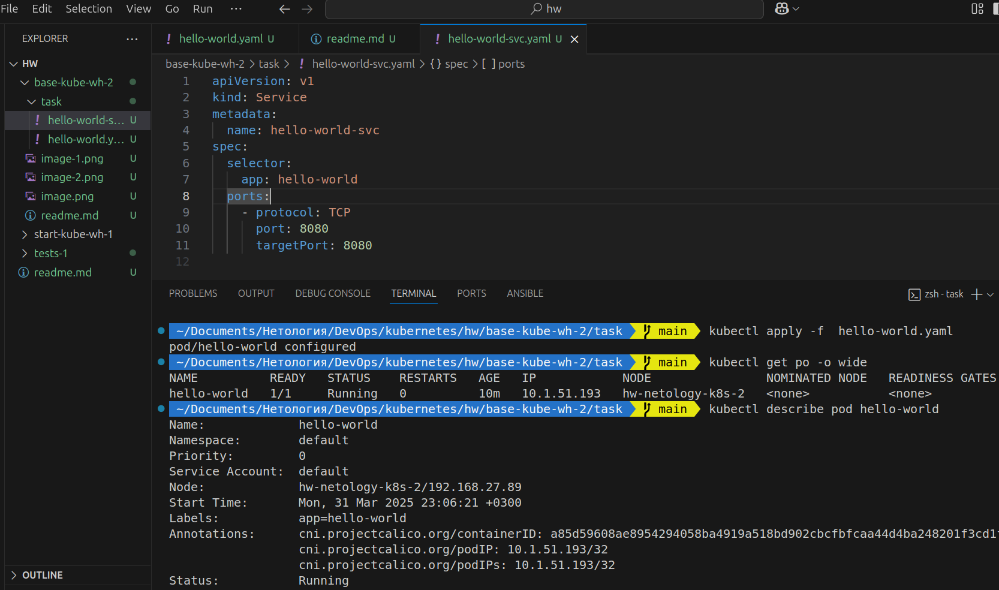
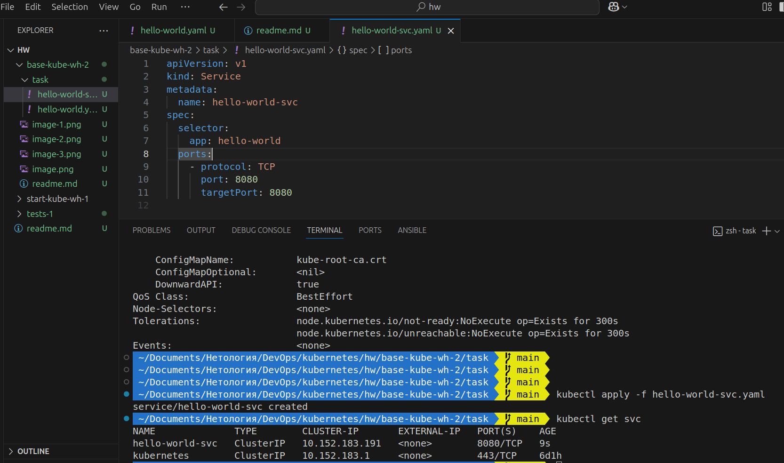
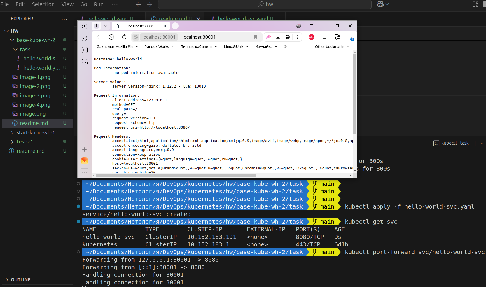

## Задание 1. Создать Pod с именем hello-world

## Задание 2. Создать Service и подключить его к Pod

pod [hello-world.yaml](./task/hello-world.yaml)

service [hello-world-svc.yaml](./task/hello-world-svc.yaml)
