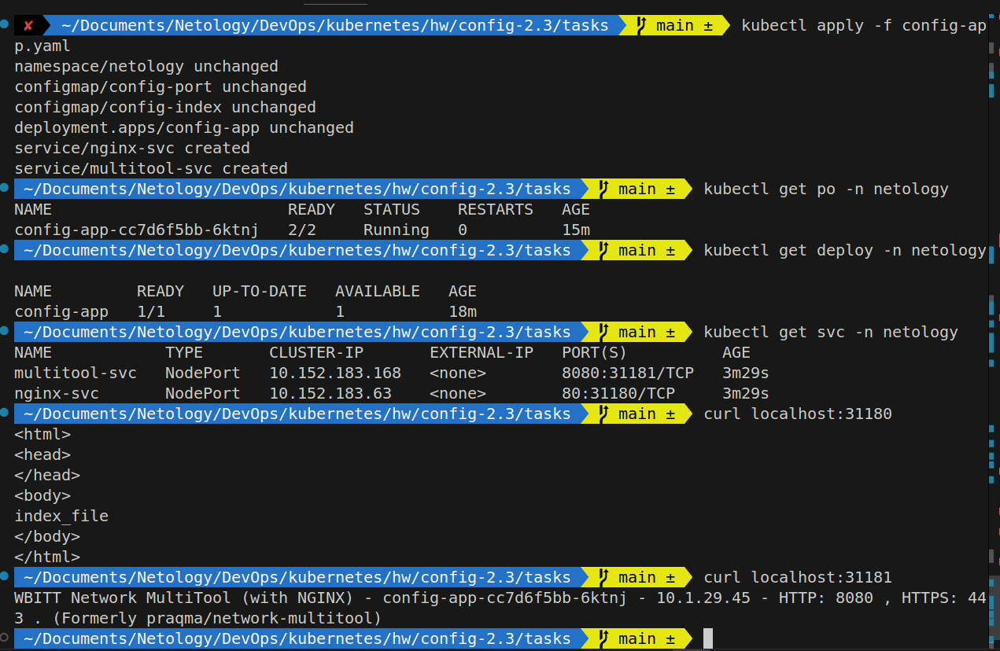
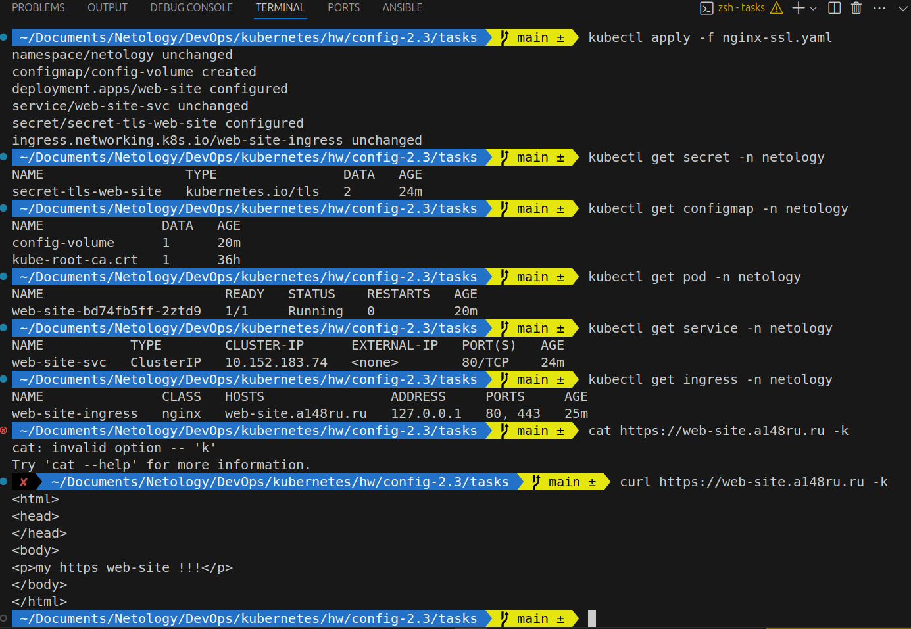
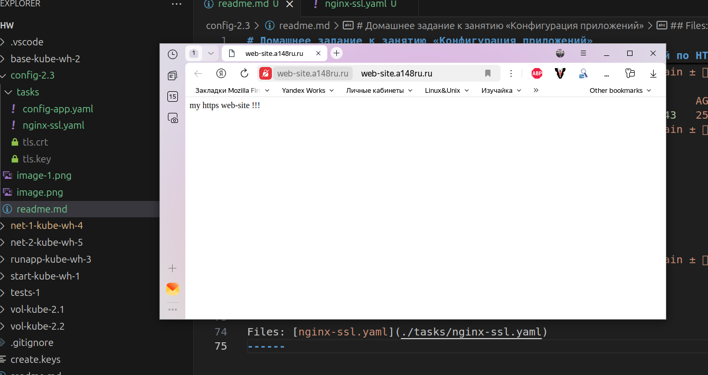

# Домашнее задание к занятию «Конфигурация приложений»

### Задание 1. Создать Deployment приложения и решить возникшую проблему с помощью ConfigMap. Добавить веб-страницу


```bash
 ~/Documents/Netology/DevOps/kubernetes/hw/config-2.3/tasks   main ±  kubectl get deploy -n netology

NAME         READY   UP-TO-DATE   AVAILABLE   AGE
config-app   1/1     1            1           18m
 ~/Documents/Netology/DevOps/kubernetes/hw/config-2.3/tasks   main ±  kubectl get svc -n netology
NAME            TYPE       CLUSTER-IP       EXTERNAL-IP   PORT(S)          AGE
multitool-svc   NodePort   10.152.183.168   <none>        8080:31181/TCP   3m29s
nginx-svc       NodePort   10.152.183.63    <none>        80:31180/TCP     3m29s
 ~/Documents/Netology/DevOps/kubernetes/hw/config-2.3/tasks   main ±  curl localhost:31180
<html>
<head>
</head>
<body>
index_file
</body>
</html>
 ~/Documents/Netology/DevOps/kubernetes/hw/config-2.3/tasks   main ±  curl localhost:31181
WBITT Network MultiTool (with NGINX) - config-app-cc7d6f5bb-6ktnj - 10.1.29.45 - HTTP: 8080 , HTTPS: 443 . (Formerly praqma/network-multitool)
 ~/Documents/Netology/DevOps/kubernetes/hw/config-2.3/tasks   main ±  
 ```




Files: [config-app.yaml](./tasks/config-app.yaml)

------

### Задание 2. Создать приложение с вашей веб-страницей, доступной по HTTPS 

```bash
 ~/Documents/Netology/DevOps/kubernetes/hw/config-2.3/tasks   main ±  kubectl apply -f nginx-ssl.yaml
namespace/netology unchanged
configmap/config-volume created
deployment.apps/web-site configured
service/web-site-svc unchanged
secret/secret-tls-web-site configured
ingress.networking.k8s.io/web-site-ingress unchanged
 ~/Documents/Netology/DevOps/kubernetes/hw/config-2.3/tasks   main ±  kubectl get secret -n netology
NAME                  TYPE                DATA   AGE
secret-tls-web-site   kubernetes.io/tls   2      24m
 ~/Documents/Netology/DevOps/kubernetes/hw/config-2.3/tasks   main ±  kubectl get configmap -n netology
NAME               DATA   AGE
config-volume      1      20m
kube-root-ca.crt   1      36h
 ~/Documents/Netology/DevOps/kubernetes/hw/config-2.3/tasks   main ±  kubectl get pod -n netology
NAME                       READY   STATUS    RESTARTS   AGE
web-site-bd74fb5ff-2ztd9   1/1     Running   0          20m
 ~/Documents/Netology/DevOps/kubernetes/hw/config-2.3/tasks   main ±  kubectl get service -n netology
NAME           TYPE        CLUSTER-IP      EXTERNAL-IP   PORT(S)   AGE
web-site-svc   ClusterIP   10.152.183.74   <none>        80/TCP    24m
 ~/Documents/Netology/DevOps/kubernetes/hw/config-2.3/tasks   main ±  kubectl get ingress -n netology
NAME               CLASS   HOSTS                ADDRESS     PORTS     AGE
web-site-ingress   nginx   web-site.a148ru.ru   127.0.0.1   80, 443   25m
 ~/Documents/Netology/DevOps/kubernetes/hw/config-2.3/tasks   main ±  curl https://web-site.a148ru.ru -k
<html>
<head>
</head>
<body>
<p>my https web-site !!!</p>
</body>
</html>
 ~/Documents/Netology/DevOps/kubernetes/hw/config-2.3/tasks   main ±  
 ```




Files: [nginx-ssl.yaml](./tasks/nginx-ssl.yaml)
------