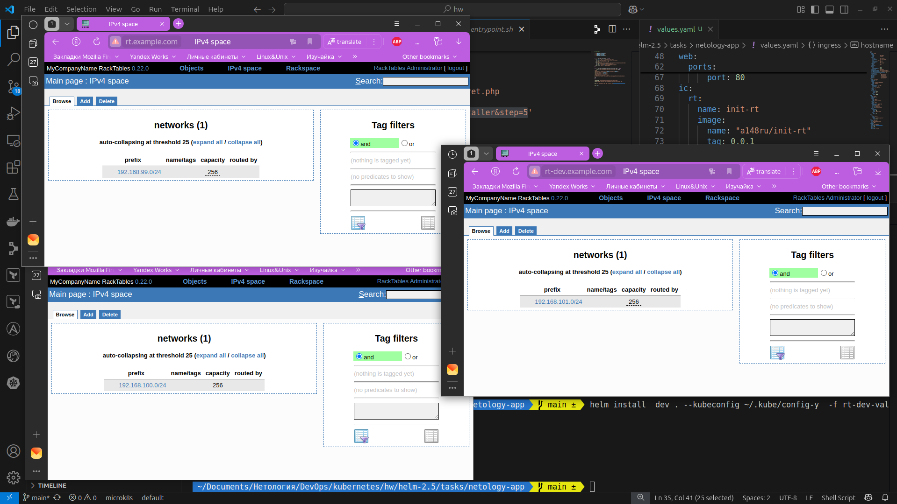
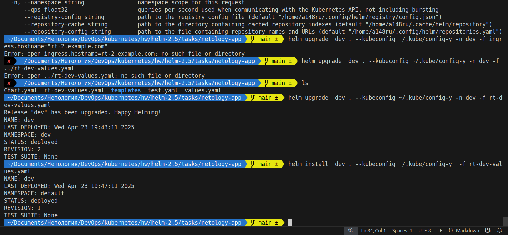
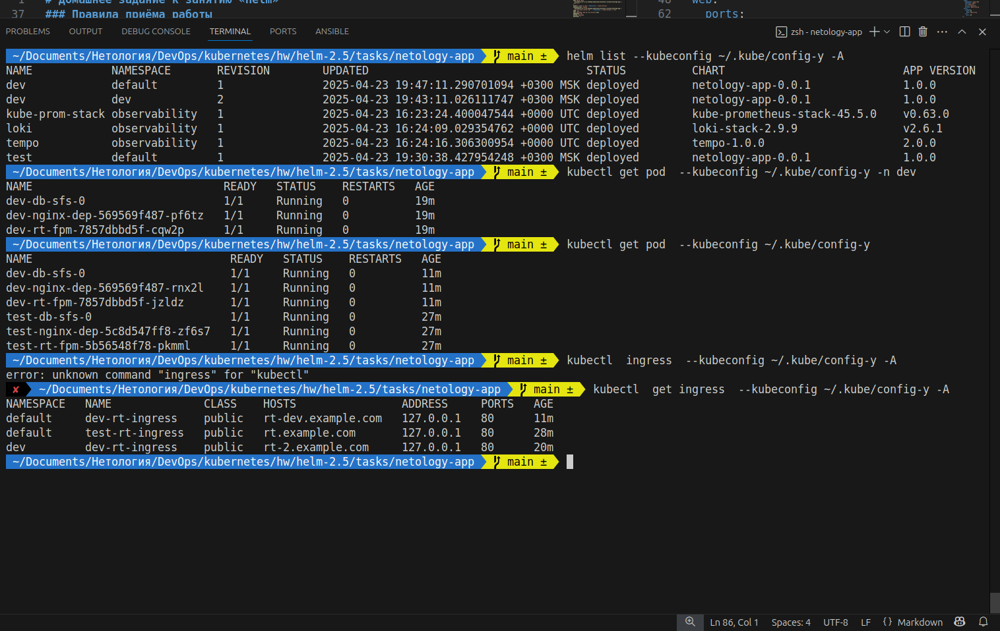

# Домашнее задание к занятию «Helm»

### Цель задания


### Задание 1. Подготовить Helm-чарт для приложения




```bash
 ~/Documents/Нетология/DevOps/kubernetes/hw/helm-2.5/tasks/netology-app   main ±  helm install test . --kubeconfig ~/.kube/config-y
NAME: test
LAST DEPLOYED: Wed Apr 23 19:30:38 2025
NAMESPACE: default
STATUS: deployed
REVISION: 1
TEST SUITE: None
 ~/Documents/Нетология/DevOps/kubernetes/hw/helm-2.5/tasks/netology-app   main ±  
# ... 
kubectl create ns dev --kubeconfig ~/.kube/config-y 
namespace/dev created
 ~/Documents/Нетология/DevOps/kubernetes/hw/helm-2.5/tasks/netology-app   main ±  helm install dev . --kubeconfig ~/.kube/config-y -n dev
NAME: dev
LAST DEPLOYED: Wed Apr 23 19:38:26 2025
NAMESPACE: dev
STATUS: deployed
REVISION: 1
TEST SUITE: None
# ...
 ~/Documents/Нетология/DevOps/kubernetes/hw/helm-2.5/tasks/netology-app   main ±  helm upgrade  dev . --kubeconfig ~/.kube/config-y -n dev -f rt-dev-values.yaml 
Release "dev" has been upgraded. Happy Helming!
NAME: dev
LAST DEPLOYED: Wed Apr 23 19:43:11 2025
NAMESPACE: dev
STATUS: deployed
REVISION: 2
TEST SUITE: None
 ~/Documents/Нетология/DevOps/kubernetes/hw/helm-2.5/tasks/netology-app   main ±  helm install  dev . --kubeconfig ~/.kube/config-y  -f rt-dev-values.yaml   
NAME: dev
LAST DEPLOYED: Wed Apr 23 19:47:11 2025
NAMESPACE: default
STATUS: deployed
REVISION: 1
TEST SUITE: None
 ~/Documents/Нетология/DevOps/kubernetes/hw/helm-2.5/tasks/netology-app   main ±  
 ```




Files: [netology-app](./tasks/netology-app/)

_выполнил для namespase=default - две версии и для namespace=dev одну_

За основу брал docker-compose тут https://github.com/collabnix/racktables-docker
