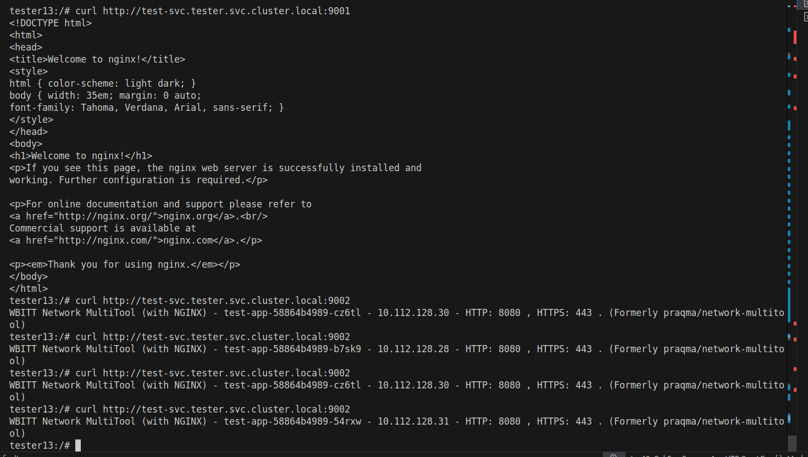
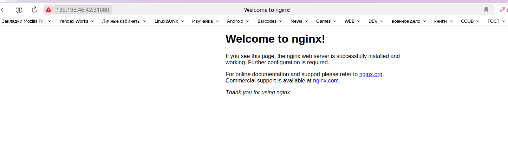

# Домашнее задание к занятию «Сетевое взаимодействие в K8S. Часть 1»


### Задание 1. Создать Deployment и обеспечить доступ к контейнерам приложения по разным портам из другого Pod внутри кластера


```bash
tester13:/# curl http://test-svc.tester.svc.cluster.local:9001
<!DOCTYPE html>
<html>
<head>
<title>Welcome to nginx!</title>
<style>
html { color-scheme: light dark; }
body { width: 35em; margin: 0 auto;
font-family: Tahoma, Verdana, Arial, sans-serif; }
</style>
</head>
<body>
<h1>Welcome to nginx!</h1>
<p>If you see this page, the nginx web server is successfully installed and
working. Further configuration is required.</p>

<p>For online documentation and support please refer to
<a href="http://nginx.org/">nginx.org</a>.<br/>
Commercial support is available at
<a href="http://nginx.com/">nginx.com</a>.</p>

<p><em>Thank you for using nginx.</em></p>
</body>
</html>
tester13:/# curl http://test-svc.tester.svc.cluster.local:9002
WBITT Network MultiTool (with NGINX) - test-app-58864b4989-cz6tl - 10.112.128.30 - HTTP: 8080 , HTTPS: 443 . (Formerly praqma/network-multitool)
tester13:/# curl http://test-svc.tester.svc.cluster.local:9002
WBITT Network MultiTool (with NGINX) - test-app-58864b4989-b7sk9 - 10.112.128.28 - HTTP: 8080 , HTTPS: 443 . (Formerly praqma/network-multitool)
tester13:/# curl http://test-svc.tester.svc.cluster.local:9002
WBITT Network MultiTool (with NGINX) - test-app-58864b4989-cz6tl - 10.112.128.30 - HTTP: 8080 , HTTPS: 443 . (Formerly praqma/network-multitool)
tester13:/# curl http://test-svc.tester.svc.cluster.local:9002
WBITT Network MultiTool (with NGINX) - test-app-58864b4989-54rxw - 10.112.128.31 - HTTP: 8080 , HTTPS: 443 . (Formerly praqma/network-multitool)
tester13:/# 
```


files:
[app-nginx-dsp.yml](./tasks/app-nginx-dsp.yml)

------

### Задание 2. Создать Service и обеспечить доступ к приложениям снаружи кластера




files:
[np-service.yml](./tasks/np-service.yaml)

------