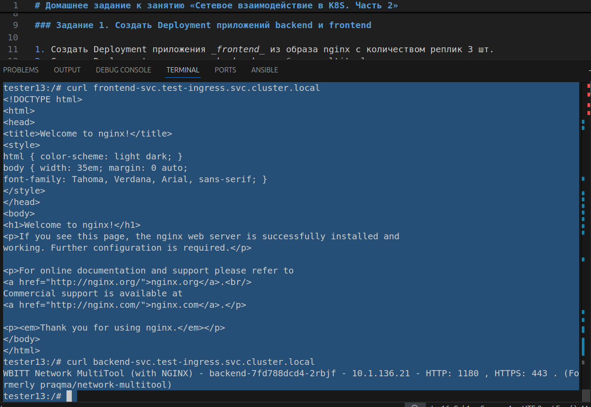
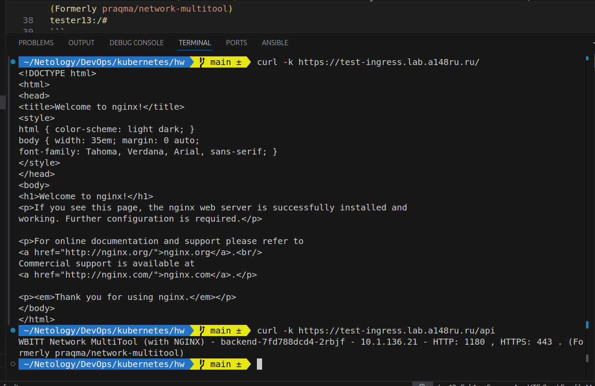

# Домашнее задание к занятию «Сетевое взаимодействие в K8S. Часть 2»

### Цель задания

В тестовой среде Kubernetes необходимо обеспечить доступ к двум приложениям снаружи кластера по разным путям.

------

### Задание 1. Создать Deployment приложений backend и frontend

```bash
tester13:/# curl frontend-svc.test-ingress.svc.cluster.local
<!DOCTYPE html>
<html>
<head>
<title>Welcome to nginx!</title>
<style>
html { color-scheme: light dark; }
body { width: 35em; margin: 0 auto;
font-family: Tahoma, Verdana, Arial, sans-serif; }
</style>
</head>
<body>
<h1>Welcome to nginx!</h1>
<p>If you see this page, the nginx web server is successfully installed and
working. Further configuration is required.</p>

<p>For online documentation and support please refer to
<a href="http://nginx.org/">nginx.org</a>.<br/>
Commercial support is available at
<a href="http://nginx.com/">nginx.com</a>.</p>

<p><em>Thank you for using nginx.</em></p>
</body>
</html>
tester13:/# curl backend-svc.test-ingress.svc.cluster.local
WBITT Network MultiTool (with NGINX) - backend-7fd788dcd4-2rbjf - 10.1.136.21 - HTTP: 1180 , HTTPS: 443 . (Formerly praqma/network-multitool)
tester13:/# 
```



files: [apps.yml](./tasks/apps.yml)

------

### Задание 2. Создать Ingress и обеспечить доступ к приложениям снаружи кластера

```bash
 ~/Netology/DevOps/kubernetes/hw   main ±  curl -k https://test-ingress.lab.a148ru.ru/   
<!DOCTYPE html>
<html>
<head>
<title>Welcome to nginx!</title>
<style>
html { color-scheme: light dark; }
body { width: 35em; margin: 0 auto;
font-family: Tahoma, Verdana, Arial, sans-serif; }
</style>
</head>
<body>
<h1>Welcome to nginx!</h1>
<p>If you see this page, the nginx web server is successfully installed and
working. Further configuration is required.</p>

<p>For online documentation and support please refer to
<a href="http://nginx.org/">nginx.org</a>.<br/>
Commercial support is available at
<a href="http://nginx.com/">nginx.com</a>.</p>

<p><em>Thank you for using nginx.</em></p>
</body>
</html>
 ~/Netology/DevOps/kubernetes/hw   main ±  curl -k https://test-ingress.lab.a148ru.ru/api
WBITT Network MultiTool (with NGINX) - backend-7fd788dcd4-2rbjf - 10.1.136.21 - HTTP: 1180 , HTTPS: 443 . (Formerly praqma/network-multitool)
 ~/Netology/DevOps/kubernetes/hw   main ±  
 ```



files: [ingress.yml](./tasks/ingress.yml)

------
