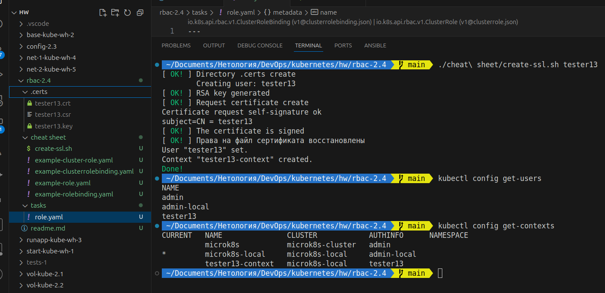
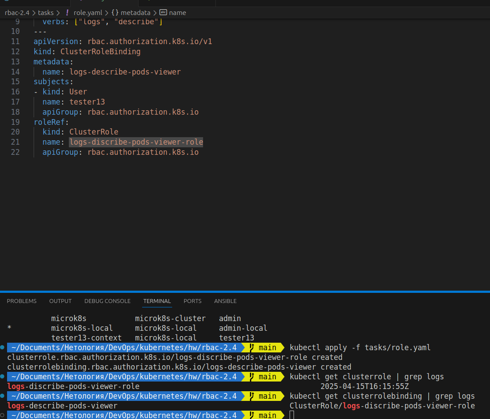
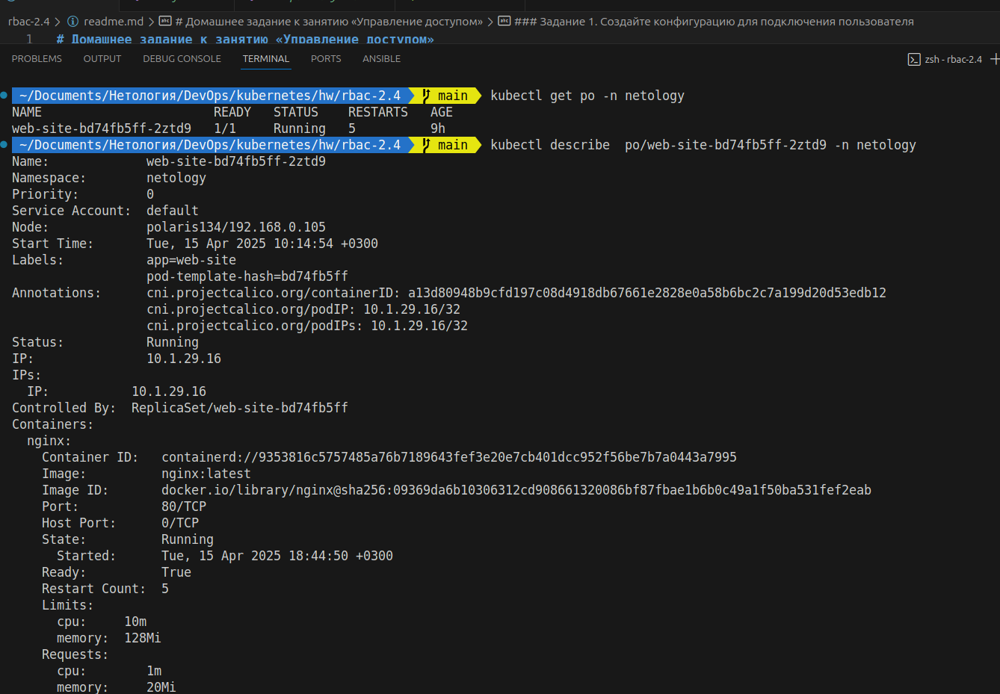
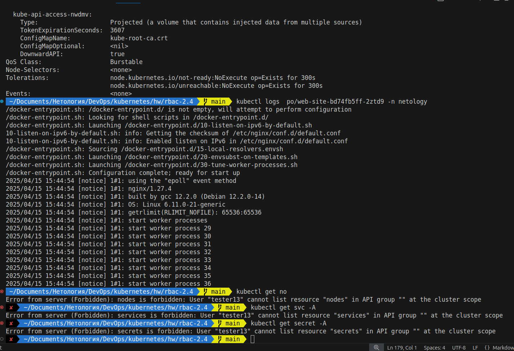

# Домашнее задание к занятию «Управление доступом»


### Задание 1. Создайте конфигурацию для подключения пользователя

создание и подписание сертификата для пользователя.
сделал простенький скрипт (см. Files)

```bash
 ~/Documents/Нетология/DevOps/kubernetes/hw/rbac-2.4   main  ./cheat\ sheet/create-ssl.sh tester13         
[ OK! ] Directory .certs create
        Creating user: tester13
[ OK! ] RSA key generated
[ OK! ] Request certificate create
Certificate request self-signature ok
subject=CN = tester13
[ OK! ] The certificate is signed
[ OK! ] Права на файл сертификата восстановлены
User "tester13" set.
Context "tester13-context" created.
Done!
 ~/Documents/Нетология/DevOps/kubernetes/hw/rbac-2.4   main  kubectl config get-users                      
NAME
admin
admin-local
tester13
 ~/Documents/Нетология/DevOps/kubernetes/hw/rbac-2.4   main  kubectl config get-contexts
CURRENT   NAME               CLUSTER            AUTHINFO      NAMESPACE
          microk8s           microk8s-cluster   admin         
*         microk8s-local     microk8s-local     admin-local   
          tester13-context   microk8s-local     tester13      
 ~/Documents/Нетология/DevOps/kubernetes/hw/rbac-2.4   main   
 ```



==В задании умолчали про неймспейс, сделал роль для всего кластера.`logs` и `describe` бесполезны без `get` - добавил.==
==также добавил `list` - можно узнать имена подов перед тем как смотреть их логи и описание.==

```bash
 ~/Documents/Нетология/DevOps/kubernetes/hw/rbac-2.4   main  kubectl apply -f tasks/role.yaml 
clusterrole.rbac.authorization.k8s.io/logs-discribe-pods-viewer-role created
clusterrolebinding.rbac.authorization.k8s.io/logs-describe-pods-viewer created
 ~/Documents/Нетология/DevOps/kubernetes/hw/rbac-2.4   main  kubectl get clusterrole | grep logs
logs-discribe-pods-viewer-role                                         2025-04-15T16:15:55Z
 ~/Documents/Нетология/DevOps/kubernetes/hw/rbac-2.4   main  kubectl get clusterrolebinding | grep logs
logs-describe-pods-viewer                                       ClusterRole/logs-discribe-pods-viewer-role                                  39s
 ~/Documents/Нетология/DevOps/kubernetes/hw/rbac-2.4   main  
 ```
 
 

```bash
 ~/Documents/Нетология/DevOps/kubernetes/hw/rbac-2.4   main  kubectl get po -n netology
NAME                       READY   STATUS    RESTARTS   AGE
web-site-bd74fb5ff-2ztd9   1/1     Running   5          9h
 ~/Documents/Нетология/DevOps/kubernetes/hw/rbac-2.4   main  kubectl describe  po/web-site-bd74fb5ff-2ztd9 -n netology
Name:             web-site-bd74fb5ff-2ztd9
Namespace:        netology
Priority:         0
Service Account:  default
Node:             polaris134/192.168.0.105
Start Time:       Tue, 15 Apr 2025 10:14:54 +0300
Labels:           app=web-site
                  pod-template-hash=bd74fb5ff
Annotations:      cni.projectcalico.org/containerID: a13d80948b9cfd197c08d4918db67661e2828e0a58b6bc2c7a199d20d53edb12
                  cni.projectcalico.org/podIP: 10.1.29.16/32
                  cni.projectcalico.org/podIPs: 10.1.29.16/32
Status:           Running
IP:               10.1.29.16
IPs:
  IP:           10.1.29.16
Controlled By:  ReplicaSet/web-site-bd74fb5ff
Containers:
  nginx:
    Container ID:   containerd://9353816c5757485a76b7189643fef3e20e7cb401dcc952f56be7b7a0443a7995
    Image:          nginx:latest
    Image ID:       docker.io/library/nginx@sha256:09369da6b10306312cd908661320086bf87fbae1b6b0c49a1f50ba531fef2eab
    Port:           80/TCP
    Host Port:      0/TCP
    State:          Running
      Started:      Tue, 15 Apr 2025 18:44:50 +0300
    Ready:          True
    Restart Count:  5
    Limits:
      cpu:     10m
      memory:  128Mi
    Requests:
      cpu:        1m
      memory:     20Mi
    Environment:  <none>
    Mounts:
      /usr/share/nginx/html from configmap-volume (rw)
      /var/run/secrets/kubernetes.io/serviceaccount from kube-api-access-nwdmv (ro)
Conditions:
  Type                        Status
  PodReadyToStartContainers   True 
  Initialized                 True 
  Ready                       True 
  ContainersReady             True 
  PodScheduled                True 
Volumes:
  configmap-volume:
    Type:      ConfigMap (a volume populated by a ConfigMap)
    Name:      config-volume
    Optional:  false
  kube-api-access-nwdmv:
    Type:                    Projected (a volume that contains injected data from multiple sources)
    TokenExpirationSeconds:  3607
    ConfigMapName:           kube-root-ca.crt
    ConfigMapOptional:       <nil>
    DownwardAPI:             true
QoS Class:                   Burstable
Node-Selectors:              <none>
Tolerations:                 node.kubernetes.io/not-ready:NoExecute op=Exists for 300s
                             node.kubernetes.io/unreachable:NoExecute op=Exists for 300s
Events:                      <none>
 ~/Documents/Нетология/DevOps/kubernetes/hw/rbac-2.4   main  kubectl logs  po/web-site-bd74fb5ff-2ztd9 -n netology
/docker-entrypoint.sh: /docker-entrypoint.d/ is not empty, will attempt to perform configuration
/docker-entrypoint.sh: Looking for shell scripts in /docker-entrypoint.d/
/docker-entrypoint.sh: Launching /docker-entrypoint.d/10-listen-on-ipv6-by-default.sh
10-listen-on-ipv6-by-default.sh: info: Getting the checksum of /etc/nginx/conf.d/default.conf
10-listen-on-ipv6-by-default.sh: info: Enabled listen on IPv6 in /etc/nginx/conf.d/default.conf
/docker-entrypoint.sh: Sourcing /docker-entrypoint.d/15-local-resolvers.envsh
/docker-entrypoint.sh: Launching /docker-entrypoint.d/20-envsubst-on-templates.sh
/docker-entrypoint.sh: Launching /docker-entrypoint.d/30-tune-worker-processes.sh
/docker-entrypoint.sh: Configuration complete; ready for start up
2025/04/15 15:44:54 [notice] 1#1: using the "epoll" event method
2025/04/15 15:44:54 [notice] 1#1: nginx/1.27.4
2025/04/15 15:44:54 [notice] 1#1: built by gcc 12.2.0 (Debian 12.2.0-14) 
2025/04/15 15:44:54 [notice] 1#1: OS: Linux 6.11.0-21-generic
2025/04/15 15:44:54 [notice] 1#1: getrlimit(RLIMIT_NOFILE): 65536:65536
2025/04/15 15:44:54 [notice] 1#1: start worker processes
2025/04/15 15:44:54 [notice] 1#1: start worker process 29
2025/04/15 15:44:54 [notice] 1#1: start worker process 30
2025/04/15 15:44:54 [notice] 1#1: start worker process 31
2025/04/15 15:44:54 [notice] 1#1: start worker process 32
2025/04/15 15:44:54 [notice] 1#1: start worker process 33
2025/04/15 15:44:54 [notice] 1#1: start worker process 34
2025/04/15 15:44:54 [notice] 1#1: start worker process 35
2025/04/15 15:44:54 [notice] 1#1: start worker process 36
 ~/Documents/Нетология/DevOps/kubernetes/hw/rbac-2.4   main  kubectl get no                                       
Error from server (Forbidden): nodes is forbidden: User "tester13" cannot list resource "nodes" in API group "" at the cluster scope
 ✘  ~/Documents/Нетология/DevOps/kubernetes/hw/rbac-2.4   main  kubectl get svc -A
Error from server (Forbidden): services is forbidden: User "tester13" cannot list resource "services" in API group "" at the cluster scope
 ✘  ~/Documents/Нетология/DevOps/kubernetes/hw/rbac-2.4   main  kubectl get secret -A
Error from server (Forbidden): secrets is forbidden: User "tester13" cannot list resource "secrets" in API group "" at the cluster scope
 ✘  ~/Documents/Нетология/DevOps/kubernetes/hw/rbac-2.4   main  
 ```






### Files

- [create-ssl.sh](./cheat%20sheet/create-ssl.sh)
- [role.yaml](./tasks/role.yaml)