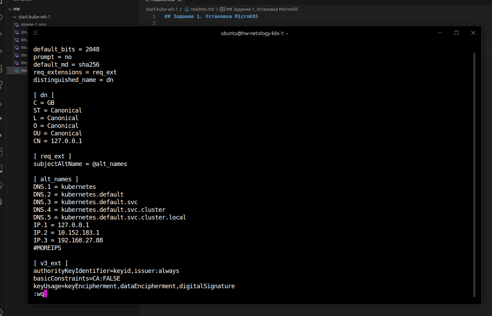
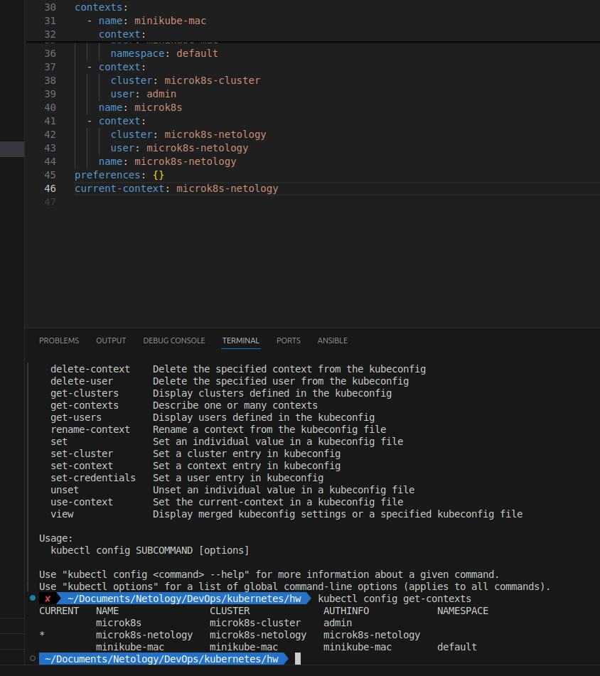
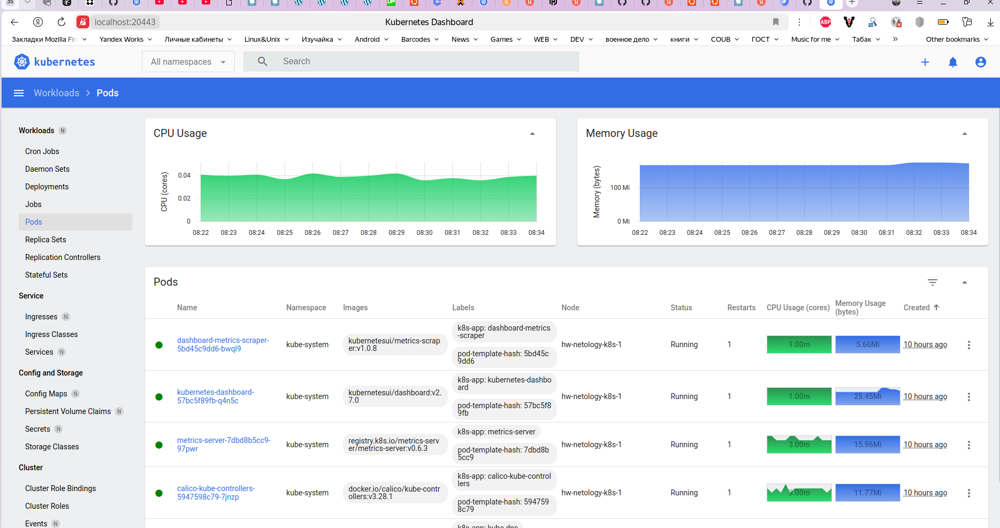

## Задание 1. Установка MicroK8S
1. устанавливаю microk8s и добавляю пользователя в группу

```bash
 ~ > ssh ubuntu@192.168.27.88
The authenticity of host '192.168.27.88 (192.168.27.88)' can't be 

...

  System load:  0.67              Processes:             103
  Usage of /:   23.8% of 6.80GB   Users logged in:       0
  Memory usage: 13%               IPv4 address for eth0: 192.168.27.88
  Swap usage:   0%

...

To run a command as administrator (user "root"), use "sudo <command>".
See "man sudo_root" for details.

ubuntu@hw-netology-k8s-1:~$ sudo snap install microk8s --classic
microk8s (1.32/stable) v1.32.2 from Canonical✓ installed
ubuntu@hw-netology-k8s-1:~$ sudo usermod -aG microk8s ubuntu
ubuntu@hw-netology-k8s-1:~$ exit
logout
Connection to 192.168.27.88 closed.
```

2. Смотрю статус, устанавливаю дашборд

```bash
 ~ > ssh ubuntu@192.168.27.88
Welcome to Ubuntu 22.04.5 LTS (GNU/Linux 5.15.0-134-generic x86_64)

 * Documentation:  https://help.ubuntu.com
 * Management:     https://landscape.canonical.com
 * Support:        https://ubuntu.com/pro

 System information as of Tue Mar 25 18:56:53 UTC 2025

  System load:  0.67              Processes:             103
  Usage of /:   23.8% of 6.80GB   Users logged in:       0
  Memory usage: 13%               IPv4 address for eth0: 192.168.27.88
  Swap usage:   0%


Expanded Security Maintenance for Applications is not enabled.

0 updates can be applied immediately.

Enable ESM Apps to receive additional future security updates.
See https://ubuntu.com/esm or run: sudo pro status

New release '24.04.2 LTS' available.
Run 'do-release-upgrade' to upgrade to it.


*** System restart required ***
Last login: Tue Mar 25 18:56:55 2025 from 192.168.27.90
ubuntu@hw-netology-k8s-1:~$ microk8s 
Available subcommands are:
        add-node
        addons
        config
        ctr
        dashboard-proxy
        dbctl
        disable
        enable
        helm
        helm3
        images
        istioctl
        join
        kubectl
        leave
        linkerd
        refresh-certs
        remove-node
        reset
        start
        status
        stop
        version
        inspect
ubuntu@hw-netology-k8s-1:~$ microk8s start
ubuntu@hw-netology-k8s-1:~$ microk8s status
microk8s is running
high-availability: no
  datastore master nodes: 127.0.0.1:19001
  datastore standby nodes: none
addons:
  enabled:
    dns                  # (core) CoreDNS
    ha-cluster           # (core) Configure high availability on the current node
    helm                 # (core) Helm - the package manager for Kubernetes
    helm3                # (core) Helm 3 - the package manager for Kubernetes
  disabled:
    cert-manager         # (core) Cloud native certificate management
    cis-hardening        # (core) Apply CIS K8s hardening
    community            # (core) The community addons repository
    dashboard            # (core) The Kubernetes dashboard
    gpu                  # (core) Alias to nvidia add-on
    host-access          # (core) Allow Pods connecting to Host services smoothly
    hostpath-storage     # (core) Storage class; allocates storage from host directory
    ingress              # (core) Ingress controller for external access
    kube-ovn             # (core) An advanced network fabric for Kubernetes
    mayastor             # (core) OpenEBS MayaStor
    metallb              # (core) Loadbalancer for your Kubernetes cluster
    metrics-server       # (core) K8s Metrics Server for API access to service metrics
    minio                # (core) MinIO object storage
    nvidia               # (core) NVIDIA hardware (GPU and network) support
    observability        # (core) A lightweight observability stack for logs, traces and metrics
    prometheus           # (core) Prometheus operator for monitoring and logging
    rbac                 # (core) Role-Based Access Control for authorisation
    registry             # (core) Private image registry exposed on localhost:32000
    rook-ceph            # (core) Distributed Ceph storage using Rook
    storage              # (core) Alias to hostpath-storage add-on, deprecated
ubuntu@hw-netology-k8s-1:~$ microk8s enable dashboard
Infer repository core for addon dashboard
Enabling Kubernetes Dashboard
Infer repository core for addon metrics-server
Enabling Metrics-Server
serviceaccount/metrics-server created
clusterrole.rbac.authorization.k8s.io/system:aggregated-metrics-reader created
clusterrole.rbac.authorization.k8s.io/system:metrics-server created
rolebinding.rbac.authorization.k8s.io/metrics-server-auth-reader created
clusterrolebinding.rbac.authorization.k8s.io/metrics-server:system:auth-delegator created
clusterrolebinding.rbac.authorization.k8s.io/system:metrics-server created
service/metrics-server created
deployment.apps/metrics-server created
apiservice.apiregistration.k8s.io/v1beta1.metrics.k8s.io created
clusterrolebinding.rbac.authorization.k8s.io/microk8s-admin created
Metrics-Server is enabled
Applying manifest
serviceaccount/kubernetes-dashboard created
service/kubernetes-dashboard created
secret/kubernetes-dashboard-certs created
secret/kubernetes-dashboard-csrf created
secret/kubernetes-dashboard-key-holder created
configmap/kubernetes-dashboard-settings created
role.rbac.authorization.k8s.io/kubernetes-dashboard created
clusterrole.rbac.authorization.k8s.io/kubernetes-dashboard created
rolebinding.rbac.authorization.k8s.io/kubernetes-dashboard created
clusterrolebinding.rbac.authorization.k8s.io/kubernetes-dashboard created
deployment.apps/kubernetes-dashboard created
service/dashboard-metrics-scraper created
deployment.apps/dashboard-metrics-scraper created
secret/microk8s-dashboard-token created

If RBAC is not enabled access the dashboard using the token retrieved with:

microk8s kubectl describe secret -n kube-system microk8s-dashboard-token

Use this token in the https login UI of the kubernetes-dashboard service.

In an RBAC enabled setup (microk8s enable RBAC) you need to create a user with restricted
permissions as shown in:
https://github.com/kubernetes/dashboard/blob/master/docs/user/access-control/creating-sample-user.md

ubuntu@hw-netology-k8s-1:~$ microk8s status
microk8s is running
high-availability: no
  datastore master nodes: 127.0.0.1:19001
  datastore standby nodes: none
addons:
  enabled:
    dashboard            # (core) The Kubernetes dashboard
    dns                  # (core) CoreDNS
    ha-cluster           # (core) Configure high availability on the current node
    helm                 # (core) Helm - the package manager for Kubernetes
    helm3                # (core) Helm 3 - the package manager for Kubernetes
    metrics-server       # (core) K8s Metrics Server for API access to service metrics
  disabled:
    cert-manager         # (core) Cloud native certificate management
    cis-hardening        # (core) Apply CIS K8s hardening
    community            # (core) The community addons repository
    gpu                  # (core) Alias to nvidia add-on
    host-access          # (core) Allow Pods connecting to Host services smoothly
    hostpath-storage     # (core) Storage class; allocates storage from host directory
    ingress              # (core) Ingress controller for external access
    kube-ovn             # (core) An advanced network fabric for Kubernetes
    mayastor             # (core) OpenEBS MayaStor
    metallb              # (core) Loadbalancer for your Kubernetes cluster
    minio                # (core) MinIO object storage
    nvidia               # (core) NVIDIA hardware (GPU and network) support
    observability        # (core) A lightweight observability stack for logs, traces and metrics
    prometheus           # (core) Prometheus operator for monitoring and logging
    rbac                 # (core) Role-Based Access Control for authorisation
    registry             # (core) Private image registry exposed on localhost:32000
    rook-ceph            # (core) Distributed Ceph storage using Rook
    storage              # (core) Alias to hostpath-storage add-on, deprecated
ubuntu@hw-netology-k8s-1:~$ 
```

3. отредактировал файл шаблона кнфига, добавил внешний адрес и сгенерировал сертификат 



```bash
ubuntu@hw-netology-k8s-1:~$ sudo vi /var/snap/microk8s/current/certs/
apiserver-kubelet-client.crt  controller.crt                front-proxy-ca.srl            proxy.key
apiserver-kubelet-client.key  controller.key                front-proxy-client.crt        scheduler.crt
ca.crt                        csr.conf                      front-proxy-client.csr        scheduler.key
ca.key                        csr.conf.rendered             front-proxy-client.key        server.crt
ca.srl                        csr.conf.template             kubelet.crt                   server.csr
client.crt                    front-proxy-ca.crt            kubelet.key                   server.key
client.key                    front-proxy-ca.key            proxy.crt                     serviceaccount.key
ubuntu@hw-netology-k8s-1:~$ sudo vi /var/snap/microk8s/current/certs/csr.conf.template 
ubuntu@hw-netology-k8s-1:~$ sudo microk8s refresh-certs --cert front-proxy-client.crt
Taking a backup of the current certificates under /var/snap/microk8s/7731/certs-backup/
Creating new certificates
Signature ok
subject=CN = front-proxy-client
Getting CA Private Key
Restarting service kubelite.
ubuntu@hw-netology-k8s-1:~$ 
```


## Задание 2. Установка и настройка локального kubectl

1. на основной машине уже установлен

```bash
 ~  kubectl version
Client Version: v1.32.2
Kustomize Version: v5.5.0
Server Version: v1.32.2
 ~  
```

2. получи конфиг

```bash
ubuntu@hw-netology-k8s-1:~$ microk8s config
apiVersion: v1
clusters:
- cluster:
    certificate-authority-data: LS0tLS1CRUdJTiBD....tLS0tCg==
    server: https://192.168.27.88:16443
  name: microk8s-cluster
contexts:
- context:
    cluster: microk8s-cluster
    user: admin
  name: microk8s
current-context: microk8s
kind: Config
preferences: {}
users:
- name: admin
  user:
    client-certificate-data: LS0tLS1C...S0tLS0K
    client-key-data: LS0tLS1CRUdJTiBSU0...SBLRVktLS0tLQo=

ubuntu@hw-netology-k8s-1:~$ 
```

3. дбавил данные для подключения в `~/.kube/config` на основной машине



4. Пробросил порт на основную машину

```bash
~  kubectl port-forward -n kube-system service/kubernetes-dashboard 20443:443 --address 0.0.0.0

Forwarding from 0.0.0.0:20443 -> 8443

```

5. делаю токен

```bash
 ~ > kubectl create token default 
eyJd...RVIwxkIgLFCRQ
 ~ > 
 ```

6. авторизация в даше с помощью токена

