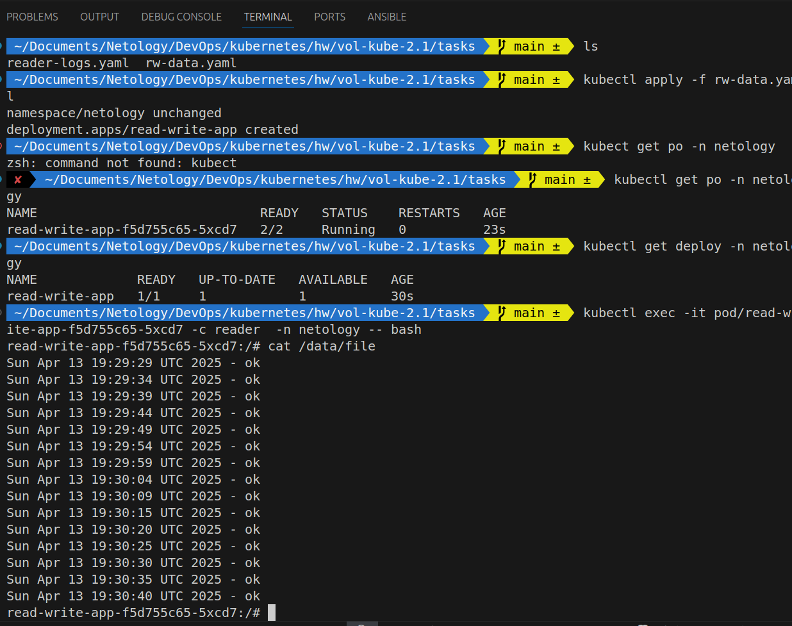
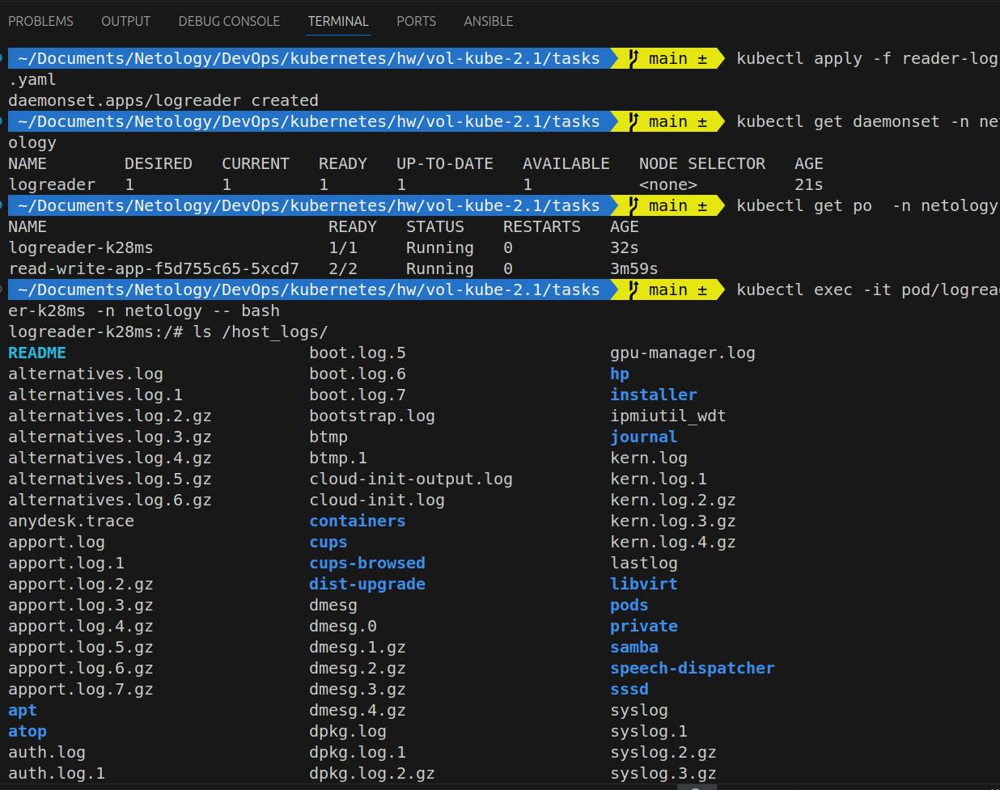
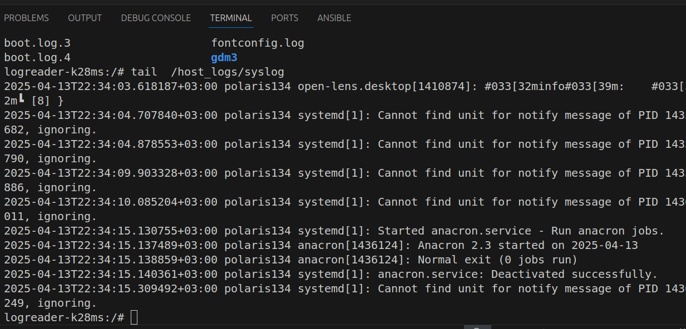

# Домашнее задание к занятию «Хранение в K8s. Часть 1»

### Задание 1 

**Что нужно сделать**

Создать Deployment приложения, состоящего из двух контейнеров и обменивающихся данными.

```bash
 ~/Documents/Netology/DevOps/kubernetes/hw/vol-kube-2.1/tasks   main ±  ls
reader-logs.yaml  rw-data.yaml
 ~/Documents/Netology/DevOps/kubernetes/hw/vol-kube-2.1/tasks   main ±  kubectl apply -f rw-data.yaml
namespace/netology unchanged
deployment.apps/read-write-app created
 ~/Documents/Netology/DevOps/kubernetes/hw/vol-kube-2.1/tasks   main ±  kubect get po -n netology
zsh: command not found: kubect
 ✘  ~/Documents/Netology/DevOps/kubernetes/hw/vol-kube-2.1/tasks   main ±  kubectl get po -n netology
NAME                             READY   STATUS    RESTARTS   AGE
read-write-app-f5d755c65-5xcd7   2/2     Running   0          23s
 ~/Documents/Netology/DevOps/kubernetes/hw/vol-kube-2.1/tasks   main ±  kubectl get deploy -n netology
NAME             READY   UP-TO-DATE   AVAILABLE   AGE
read-write-app   1/1     1            1           30s
 ~/Documents/Netology/DevOps/kubernetes/hw/vol-kube-2.1/tasks   main ±  kubectl exec -it pod/read-write-app-f5d755c65-5xcd7 -c reader  -n netology -- bash
read-write-app-f5d755c65-5xcd7:/# cat /data/file 
Sun Apr 13 19:29:29 UTC 2025 - ok
Sun Apr 13 19:29:34 UTC 2025 - ok
...
Sun Apr 13 19:30:35 UTC 2025 - ok
Sun Apr 13 19:30:40 UTC 2025 - ok
read-write-app-f5d755c65-5xcd7:/# 
```



 Files: [Deployment - rw-data.yaml](./tasks/rw-data.yaml)

------

### Задание 2

**Что нужно сделать**

Создать DaemonSet приложения, которое может прочитать логи ноды.

```bash
 ~/Documents/Netology/DevOps/kubernetes/hw/vol-kube-2.1/tasks   main ±  kubectl apply -f reader-logs.yaml
daemonset.apps/logreader created
 ~/Documents/Netology/DevOps/kubernetes/hw/vol-kube-2.1/tasks   main ±  kubectl get daemonset -n net
ology
NAME        DESIRED   CURRENT   READY   UP-TO-DATE   AVAILABLE   NODE SELECTOR   AGE
logreader   1         1         1       1            1           <none>          21s
 ~/Documents/Netology/DevOps/kubernetes/hw/vol-kube-2.1/tasks   main ±  kubectl get po  -n netology
NAME                             READY   STATUS    RESTARTS   AGE
logreader-k28ms                  1/1     Running   0          32s
read-write-app-f5d755c65-5xcd7   2/2     Running   0          3m59s
 ~/Documents/Netology/DevOps/kubernetes/hw/vol-kube-2.1/tasks   main ±  kubectl exec -it pod/logreader-k28ms -n netology -- bash
logreader-k28ms:/# ls /host_logs/
README                         boot.log.5                     gpu-manager.log
alternatives.log               boot.log.6                     hp
alternatives.log.1             boot.log.7                     installer
alternatives.log.2.gz          bootstrap.log                  ipmiutil_wdt
alternatives.log.3.gz          btmp                           journal
alternatives.log.4.gz          btmp.1                         kern.log
alternatives.log.5.gz          cloud-init-output.log          kern.log.1
alternatives.log.6.gz          cloud-init.log                 kern.log.2.gz
anydesk.trace                  containers                     kern.log.3.gz
apport.log                     cups                           kern.log.4.gz
apport.log.1                   cups-browsed                   lastlog
apport.log.2.gz                dist-upgrade                   libvirt
apport.log.3.gz                dmesg                          pods
apport.log.4.gz                dmesg.0                        private
apport.log.5.gz                dmesg.1.gz                     samba
apport.log.6.gz                dmesg.2.gz                     speech-dispatcher
apport.log.7.gz                dmesg.3.gz                     sssd
apt                            dmesg.4.gz                     syslog
atop                           dpkg.log                       syslog.1
auth.log                       dpkg.log.1                     syslog.2.gz
auth.log.1                     dpkg.log.2.gz                  syslog.3.gz
auth.log.2.gz                  dpkg.log.3.gz                  syslog.4.gz
auth.log.3.gz                  dpkg.log.4.gz                  sysstat
auth.log.4.gz                  dpkg.log.5.gz                  ubuntu-advantage-apt-hook.log
boot.log                       dpkg.log.6.gz                  unattended-upgrades
boot.log.1                     faillog                        vbox-setup.log
boot.log.2                     firebird                       wtmp
boot.log.3                     fontconfig.log
boot.log.4                     gdm3
logreader-k28ms:/# tail  /host_logs/syslog
2025-04-13T22:34:03.618187+03:00 polaris134 open-lens.desktop[1410874]: #033[32minfo#033[39m:    #033[32m┗ [8] }
2025-04-13T22:34:04.707840+03:00 polaris134 systemd[1]: Cannot find unit for notify message of PID 1435682, ignoring.
2025-04-13T22:34:04.878553+03:00 polaris134 systemd[1]: Cannot find unit for notify message of PID 1435790, ignoring.
2025-04-13T22:34:09.903328+03:00 polaris134 systemd[1]: Cannot find unit for notify message of PID 1435886, ignoring.
2025-04-13T22:34:10.085204+03:00 polaris134 systemd[1]: Cannot find unit for notify message of PID 1436011, ignoring.
2025-04-13T22:34:15.130755+03:00 polaris134 systemd[1]: Started anacron.service - Run anacron jobs.
2025-04-13T22:34:15.137489+03:00 polaris134 anacron[1436124]: Anacron 2.3 started on 2025-04-13
2025-04-13T22:34:15.138859+03:00 polaris134 anacron[1436124]: Normal exit (0 jobs run)
2025-04-13T22:34:15.140361+03:00 polaris134 systemd[1]: anacron.service: Deactivated successfully.
2025-04-13T22:34:15.309492+03:00 polaris134 systemd[1]: Cannot find unit for notify message of PID 1436249, ignoring.
logreader-k28ms:/# 
```




Files: [DaemonSet reader-logs.yaml](./tasks/reader-logs.yaml)
