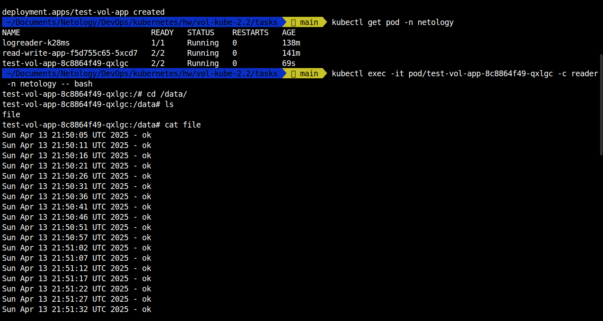
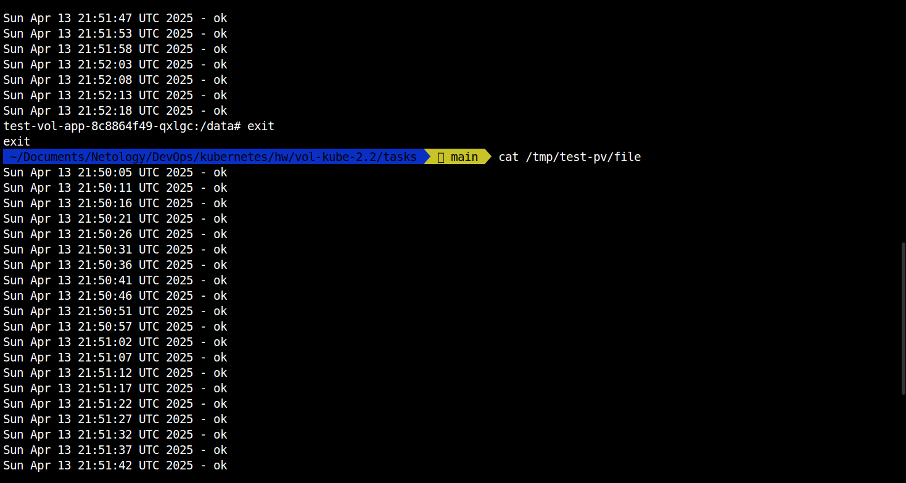
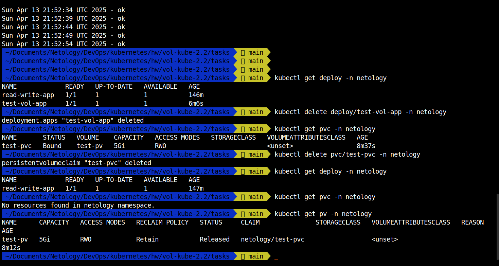
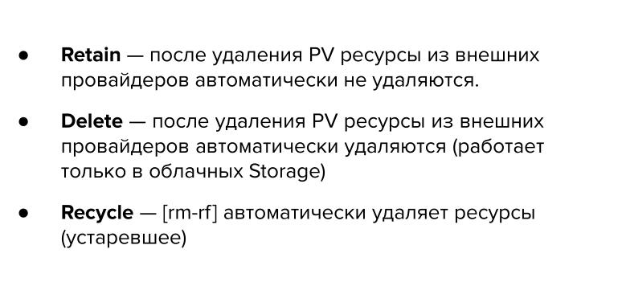
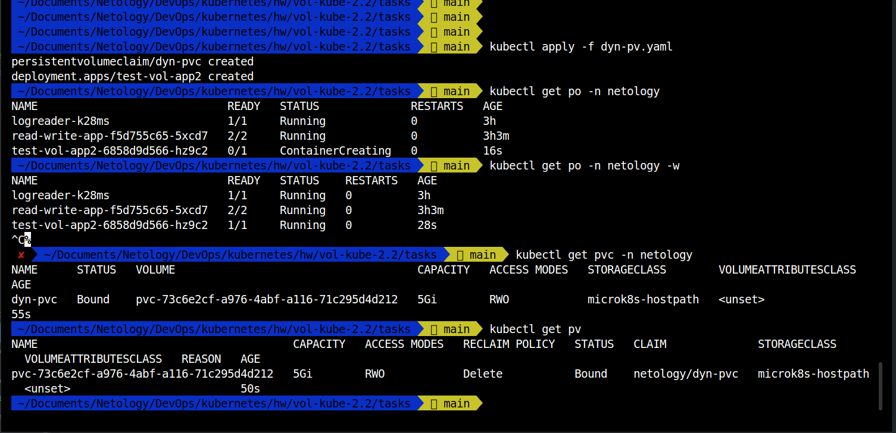
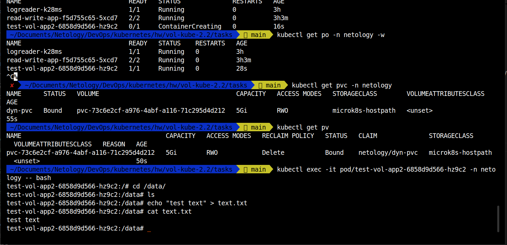
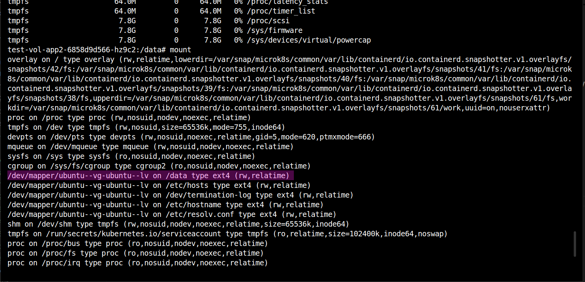

# Домашнее задание к занятию «Хранение в K8s. Часть 2»

### Задание 1

**Что нужно сделать**

Создать Deployment приложения, использующего локальный PV, созданный вручную.

```bash
 ✘  ~/Documents/Netology/DevOps/kubernetes/hw/vol-kube-2.2/tasks   main  kubectl apply -f manual-pv.yaml
persistentvolume/test-pv created
persistentvolumeclaim/test-pvc created
deployment.apps/test-vol-app created
 ~/Documents/Netology/DevOps/kubernetes/hw/vol-kube-2.2/tasks   main  kubectl get pod -n netology    
NAME                             READY   STATUS    RESTARTS   AGE
logreader-k28ms                  1/1     Running   0          138m
read-write-app-f5d755c65-5xcd7   2/2     Running   0          141m
test-vol-app-8c8864f49-qxlgc     2/2     Running   0          69s
 ~/Documents/Netology/DevOps/kubernetes/hw/vol-kube-2.2/tasks   main  kubectl exec -it pod/test-vol-app-8c8864f49-qxlgc -c reader
 -n netology -- bash
test-vol-app-8c8864f49-qxlgc:/# cd /data/
test-vol-app-8c8864f49-qxlgc:/data# ls
file
test-vol-app-8c8864f49-qxlgc:/data# cat file 
Sun Apr 13 21:50:05 UTC 2025 - ok
Sun Apr 13 21:50:11 UTC 2025 - ok
...
Sun Apr 13 21:52:08 UTC 2025 - ok
Sun Apr 13 21:52:13 UTC 2025 - ok
Sun Apr 13 21:52:18 UTC 2025 - ok
test-vol-app-8c8864f49-qxlgc:/data# exit
exit
 ~/Documents/Netology/DevOps/kubernetes/hw/vol-kube-2.2/tasks   main  cat /tmp/test-pv/file 
Sun Apr 13 21:50:05 UTC 2025 - ok
Sun Apr 13 21:50:11 UTC 2025 - ok
...
Sun Apr 13 21:52:39 UTC 2025 - ok
Sun Apr 13 21:52:44 UTC 2025 - ok
Sun Apr 13 21:52:49 UTC 2025 - ok
Sun Apr 13 21:52:54 UTC 2025 - ok
 ~/Documents/Netology/DevOps/kubernetes/hw/vol-kube-2.2/tasks   main  
 ```

 
 

 удаление DEPLOY и PVC

 

**PV статический**. Необходимо вручную удалить как PVC, так и сам PV. Это связано с тем, что статический PV создается независимо от PVC и требует явного удаления.


удаление PV

```bash
 ~/Documents/Netology/DevOps/kubernetes/hw/vol-kube-2.2/tasks   main  kubectl delete pv/test-pv -n netology
Warning: deleting cluster-scoped resources, not scoped to the provided namespace
persistentvolume "test-pv" deleted
 ~/Documents/Netology/DevOps/kubernetes/hw/vol-kube-2.2/tasks   main  kubectl get pv                       
No resources found
 ~/Documents/Netology/DevOps/kubernetes/hw/vol-kube-2.2/tasks   main  cat /tmp/test-pv/file 
Sun Apr 13 21:50:05 UTC 2025 - ok
Sun Apr 13 21:50:11 UTC 2025 - ok
Sun Apr 13 21:50:16 UTC 2025 - ok
...
Sun Apr 13 21:56:49 UTC 2025 - ok
Sun Apr 13 21:56:54 UTC 2025 - ok
 ~/Documents/Netology/DevOps/kubernetes/hw/vol-kube-2.2/tasks   main  
 ```


**PV** `RECLAIM Retain` - политика по умолчанию



Kubernetes управляет только жизненным циклом PV и PVC, а физическое удаление данных может зависеть от настроек базового хранилища.

Files: [manual-pv.yaml](./tasks/manual-pv.yaml)


------

### Задание 2

**Что нужно сделать**

Создать Deployment приложения, которое может хранить файлы на NFS с динамическим созданием PV.







Files: [dyn-pv.yaml](./tasks/dyn-pv.yaml)